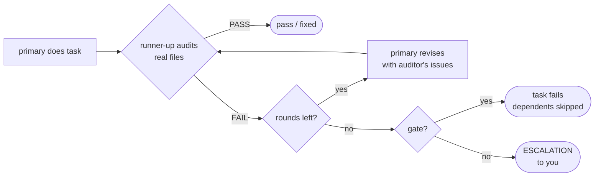

<p align="center">
  
</p>

<p align="center">
  
  
  
  
  
</p>

# Hexmind

**One chat room. Several AI models. One team.**

You type a request once. A lead model reads the team roster, decides which model is best
for each piece, and turns your request into a task graph. Independent tasks run at the
same time, later phases wait for earlier ones, and when everything is done the lead writes
you one answer.

Hexmind doesn't ask the same question to three models and paste their replies side by side.
The models split the work, hand results to each other, check each other's work, and build
a track record that decides who gets trusted with what.

- **Real agents, not API calls.** Every member runs as its own CLI (`claude`, `agy`,
  `codex`) in your project folder. Each model brings the skills, subagents, MCP servers and
  config you've already set up for it.
- **Relay chains.** Any multi-stage workflow (for example a six-stage repo audit) can run as N
  parallel chains with models rotating through the stages.
- **Peer audit.** The runner-up model reviews each task against the real files, with a
  bounded revise loop and escalation to you when they can't agree.
- **Evidence-based rankings.** Audit verdicts are recorded per model and per domain. Those
  records pick the auditors and are shown to the lead when it assigns work.

<p align="center"></p>

## Contents

- [🚀 Quickstart](#-quickstart)
- [💬 The room](#-the-room)
- [🔀 How a request flows](#-how-a-request-flows)
- [🔁 Relay chains](#-relay-chains)
- [🔍 Peer audit](#-peer-audit)
- [📊 Rankings](#-rankings)
- [🔖 Nicknames](#-nicknames)
- [🧰 Commands](#-commands)
- [📜 Chain files](#-chain-files)
- [🔌 Backends](#-backends)
- [🧭 Roadmap](#-roadmap)
- [🔧 Development](#-development)

<p align="center"></p>

## 🚀 Quickstart

**Requirements:** Python 3.11+, and at least one of these CLIs installed and logged in:

| member | CLI | runs as |
|---|---|---|
| `claude` | [Claude Code](https://claude.com/claude-code) | `claude -p … --permission-mode acceptEdits` |
| `agy` | Antigravity CLI (Google Gemini) | `agy --input-format stream-json … --mode accept-edits` |
| `codex` | [OpenAI Codex CLI](https://github.com/openai/codex) | `codex exec --sandbox workspace-write … -` |
| `opencode` | [OpenCode](https://opencode.ai) | `opencode run --auto` |
| `copilot` | [GitHub Copilot CLI](https://github.com/github/copilot-cli) | `copilot -s --allow-tool=write` (file edits yes, shell no) |
| `jules` | [Google Jules](https://jules.google) | `jules new` (cloud sessions that return as PRs) |
| `qwen` *(opt-in: `--with qwen`)* | local `qwen3:4b` via [Ollama](https://ollama.com) | text only: no files, no tools; never leads or audits; skipped by relay rotation |

Hexmind only includes members whose CLI is on your `PATH`.

```bash
git clone https://github.com/DaRipper91/hexmind.git
cd hexmind
pipx install -e .          # or: pip install -e .

cd ~/Projects/your-app
hexmind                    # open the room here
```

> [!WARNING]
> Agents run with edits auto-accepted in the room's folder so they can actually do the work.
> Use a git repo, and review diffs before you commit.

```bash
hexmind --without codex          # leave a member out (e.g. out of quota)
hexmind --lead agy               # agy plans and summarizes instead of claude
hexmind --audit                  # start with peer audit on
hexmind --cwd ~/Projects/foo     # work in another folder
hexmind --once "add a --json flag to the export command"   # headless, prints to stdout
```

<p align="center"></p>

## 💬 The room

```
┌─ Hexmind ─ direct backend · lead: claude · audit: on ────────────────────────────────────┐
│ you                                       │ ● claude (lead)  working: 1.t1               │
│ add CSV export and tests for it           │ ● agy            auditing 1.t1               │
│                                           │ ○ codex          idle                        │
│ claude                                    ├──────────────────────────────────────────────┤
│ On it: spec + build, then tests.          │ task  agent   status    audit     title      │
│                                           │ 1.t1  claude  auditing            build CSV  │
│ Hexmind                                   │ 1.t2  codex   pending             tests      │
│ Plan                                      │                                              │
│ - t1 → claude: build CSV export           │                                              │
│ - t2 → codex: tests (after t1)            ├──────────────────────────────────────────────┤
│                                           │ 1.t1 · claude · auditing                     │
│                                           │ Add a CSV exporter to …                      │
│                                           │ (no output yet)                              │
│ > Ask the team anything…                  │                                              │
└─ ^q Quit  ^l Clear chat ─────────────────────────────────────────────────────────────────┘
```

- **Chat (left):** you, the lead's replies, task completions and relay tables.
- **Team (top right):** who is working, auditing or idle, and the lead's current state
  (`planning`, `summarizing`, …).
- **Task board:** every task across the session with a live status (`pending`, `running`,
  `auditing`, `revising`, `done`, `failed`, `skipped`) and an audit result such as
  `pass·agy`, `fixed·codex` or `disputed·claude`.
- **Detail (bottom right):** arrow through the board to see a task's full instructions and
  output.
- **Escalations** show up in the chat as a red panel titled *needs you*.

If you send a request while the team is busy, it queues and starts when the current one finishes.

<p align="center"></p>

## 🔀 How a request flows

<p align="center"></p>

1. **Plan.** The lead gets the roster (strengths plus audit track record), your request and
   the last few exchanges. It answers with JSON: a reply to you plus tasks, each with an
   `agent`, `instructions`, `depends_on`, a `domain` and an optional `gate`.
2. **Validate.** Unknown agents fall back to the lead, unknown dependencies are dropped,
   duplicate ids and dependency cycles are rejected. If the lead answers in prose, that
   prose is the answer.
3. **Run as a graph.** Every task whose dependencies are done starts at once. Each task gets
   the outputs of the tasks it depends on. When a task fails, everything downstream is
   marked `skipped`, and one agent failing never takes down the room.
4. **Audit** (if on). See [Peer audit](#peer-audit).
5. **Summarize.** The lead reads every result and writes you one answer covering what was
   done, what failed, and what needs your decision.

<p align="center"></p>

## 🔁 Relay chains

A **chain** is an ordered list of stages. Each stage is done by one model, which first
reads the full report of every earlier stage from a shared notes file. Run several chains
at once and Hexmind rotates the models through the stages.

<p align="center"></p>

### Example: three full repo audits by three models

The bundled `rip-it-apart` chain imports six existing Claude Code subagents (recon →
verify → bug-hunt → strengths → critic → fix-plan) as stage instructions, so any model can
run any stage.

```
/relay rip-it-apart x3
```

With the default `--assign rotate`, each chain starts on a different model. This is the
real assignment grid:

| chain | recon | verify | bug-hunt | strengths | critic | fix-plan |
|---|---|---|---|---|---|---|
| A | claude | agy | codex | claude | agy | codex |
| B | agy | codex | claude | agy | codex | claude |
| C | codex | claude | agy | codex | claude | agy |

- **Every model runs every stage** somewhere across the three chains.
- **No model runs two stages in a row**, so the critic is never the model that just wrote
  the stage before it.
- **Chains don't collide.** With `-n > 1` inside a git repo, each chain gets its own git
  worktree and branch (`hexmind/<run>-A`, `-B`, …).
- **Results are merged.** The lead combines the three chains. Findings several chains agree
  on count as high confidence, and findings only one chain reported are flagged for a second look.

Rotation is round-robin, so with three models the critic of a chain is also the model that
ran its `verify` stage. If you want strict separation for a stage, pin it with `agent = "…"`
and `--assign pinned`.

### More ways to relay

```
/relay feature --goal "add CSV export" --assign pinned   # saved chain, pinned models
/relay feature --goal "add CSV export" --assign best     # lead picks a model per stage
/relay "migrate the config to TOML" -n 2 --end compare   # lead designs the stages itself
```

If the name isn't a saved chain, the whole text becomes a goal and the lead designs a
3–7 stage chain for it.

<details>
<summary><b>All <code>/relay</code> options</b></summary>

| option | values | default |
|---|---|---|
| `-n N` / `xN` | number of parallel chains | `1` |
| `--assign` | `rotate` · `best` (lead picks per stage) · `pinned` (stage's `agent =`) | `rotate` |
| `--workspace` | `shared` · `worktree` (own git worktree + branch per chain) | `worktree` if `-n > 1` in a git repo, else `shared` |
| `--end` | `merge` (one combined result) · `compare` (side by side) · `list` (status only) | `merge` |
| `--goal TEXT` | extra goal/context for a saved chain | chain description |

</details>

Stage reports are kept in `.hexmind/runs/<run>/chain-<X>.md` (Hexmind gitignores
`.hexmind/` automatically).

<p align="center"></p>

## 🔍 Peer audit

Turn it on with `--audit` or `/audit on`. Each task is checked by a different model than
the one that did it:

1. **Primary** does the task.
2. **Runner-up audits.** Among the other members, the one with the best track record in the
   task's domain audits it. The auditor is told to check the actual files and state in the
   task's folder, not just trust the report, and to answer `VERDICT: PASS` or `VERDICT: FAIL`
   with specific issues.
3. **Bounded revise loop.** On `FAIL`, the primary gets the auditor's issues and its previous
   output and revises. Then the auditor checks again. The loop is capped at 2 audit rounds.
4. **Resolution:**
   - `pass`: approved first time. `fixed`: approved after revision.
   - `disputed`: still failing after the last round. For a normal task you get an
     **ESCALATION** message with both sides: the auditor's issues and the last output.
   - **Gated tasks** (`"gate": true`, which the lead sets for high-impact work such as core
     logic, migrations and security) fail instead, so the tasks that depend on them are
     skipped rather than built on disputed work.



A reply with no verdict line counts as a `FAIL`. With a single member there's no one to
audit, so the task passes straight through.

<p align="center"></p>

## 📊 Rankings

Every audit's **first** verdict is recorded against the primary model in the task's domain.
Revisions don't count, so the record measures first-attempt quality.

Domains: `architecture` `implementation` `refactor` `tests` `debugging` `research` `docs`
`review` `shell` `ui` `general`

```
/ranks
```

| Agent | implementation | tests | docs |
|---|---|---|---|
| claude | 7/8 | - | 3/3 |
| agy | 4/6 | 2/2 | - |
| codex | 5/5 | 6/9 | - |

*(Example of the format. Your numbers come from your own runs.)*

Cells are `passed / audited`. Rankings use a Laplace-smoothed score `(pass+1)/(pass+fail+2)`,
so one lucky result doesn't put a model at the top. The record:

- picks the **auditor**: the best-scored other member in the task's domain.
- is shown to the **lead** in the roster every time it plans, so assignments can follow the evidence.

Stats persist in `~/.local/share/hexmind/stats.json`.

<p align="center"></p>

## 🔖 Nicknames

Give your models names. Nicknames are display-only: the chat, team pane and task board show
them, but stats and config still use `claude`, `agy` and `codex`.

```
/nick claude Rex      # set
/nick claude          # clear
/nick                 # list
```

They are saved in `~/.config/hexmind/config.toml`:

```toml
[nicknames]
claude = "Rex"
```

The lead knows the nicknames, so you can just say *"have Rex review it"*.

<p align="center"></p>

## 🧰 Commands

### In the room

| command | what it does |
|---|---|
| *any text* | the lead plans it, the team runs it |
| `/relay NAME\|GOAL [options]` | run a relay chain (see [options](#more-ways-to-relay)) |
| `/chains` | list available chain files |
| `/audit on\|off` | toggle peer audit (no argument shows the current state) |
| `/ranks` | per-model, per-domain audit track record |
| `/nick [AGENT [NAME]]` | set, clear or list [nicknames](#-nicknames) |
| `/help` | command list |

Keys: `enter` send · `↑/↓` browse tasks · `ctrl+l` clear chat · `ctrl+q` quit.

<details>
<summary><b>CLI flags</b></summary>

| flag | default | |
|---|---|---|
| `--backend direct\|hcom` | `direct` | how agents are run |
| `--lead AGENT` | `claude` | who plans and summarizes |
| `--without AGENT` | none | leave a member out (repeatable) |
| `--cwd DIR` | current dir | folder the team works in |
| `--audit` | off | start with peer audit on |
| `--once "REQUEST"` | none | run one request without the TUI and print the results |

</details>

<p align="center"></p>

## 📜 Chain files

Chains are TOML. Hexmind looks in `~/.config/hexmind/chains/` (yours win) and the bundled
`hexmind/chains/` (`feature`, `rip-it-apart`).

```toml
name = "feature"
description = "Spec, build, test, and review one feature"

[[stages]]
name = "spec"
instructions = "Read the code this touches. Write a short spec. Don't write code."
domain = "architecture"      # optional: ranking domain for this stage
agent = "claude"             # optional: used with --assign pinned

[[stages]]
name = "build"
instructions = "Implement the spec from the notes file. Keep the diff minimal."
domain = "implementation"
gate = true                  # optional: unresolved audit failure blocks later stages

[[stages]]
name = "review"
from = "~/.claude/agents/code-reviewer.md"   # import an existing agent's instructions
```

**Bring your existing agents.** `from =` turns an agent you've already written into a stage
any model can run:

- **Claude Code agents** (`.md`): the frontmatter is stripped and the body becomes the instructions.
- **Codex agents** (`.toml`): Hexmind reads `developer_instructions`, falling back to
  `instructions` or `description`.

<p align="center"></p>

## 🔌 Backends

Every backend has the same interface: `await backend.run(agent, prompt, cwd) -> str`.

| backend | status | how it works |
|---|---|---|
| **direct** | ✅ default | Hexmind launches each CLI in non-interactive mode itself and sends the prompt on stdin, so prompts of any size work (`claude -p`, `agy` stream-json, `codex exec -`). Nothing else to install; each call has a 30-minute timeout, and a timed-out process is killed and reaped. |
| **hcom** | ✅ live-tested with Claude | `--backend hcom`: each model is a persistent, headless [hcom](https://pypi.org/project/hcom/) agent, started the first time it gets work and reused after that (a warm request took under 4 s). Every request runs on its own thread, so replies never mix. Hexmind waits until an agent is ready, and never inherits the hcom identity of whatever launched it. Requires `hcom`. A folder a CLI has never opened stops at that CLI's trust prompt: Hexmind stops the agent and tells you to open the folder once (`cd <folder> && claude`) and accept. |

<p align="center"></p>

## 🧭 Roadmap

- [x] **Core team:** lead planning, parallel task graph, direct backend, Textual TUI
- [x] **Relay chains:** saved, imported or lead-designed chains, N in parallel, rotating models, worktrees
- [x] **Peer audit:** runner-up auditor, bounded revise loop, gated tasks, escalation
- [x] **Evidence-based rankings:** per-domain track record that drives auditor choice and lead assignments
- [x] **hcom backend**: persistent headless hcom agents, one thread per request (live-tested with Claude)
- [x] **Nicknames**: `/nick` display names that the lead also understands
- [x] **Hardening pass** from an independent review: stdin prompts, apostrophes in `/relay`, malformed plans and broken chain files reported instead of crashing
- [ ] **hcom split-terminal mode:** watch each model work in its own pane
- [x] **Jules** as a team member for long-running cloud tasks that come back as PRs
- [ ] **`hexmind.qt.HexmindWidget`**: an embeddable Qt room, hosted by the rebuilt Aether (Hexmind never imports Aether)
- [ ] **GUI** (PySide6), standalone

<p align="center"></p>

## 🔧 Development

```bash
pip install -e . pytest
python3 -m pytest tests
```

The tests use a fake backend, so no model CLIs or network are needed. They cover plan
parsing and the task graph (`test_core.py`), relay loading, rotation and worktrees
(`test_relay.py`), the auditor and rankings (`test_auditor.py`,
`test_audit_integration.py`), both backends with mocked subprocesses (`test_backends.py`,
`test_hcom_backend.py`), nicknames (`test_nicknames.py`), and the TUI running headless (`test_tui.py`).

<details>
<summary><b>Project layout</b></summary>

```
hexmind/
├── __main__.py   CLI entry point
├── core.py       roster, plan parsing, orchestrator (task graph)
├── relay.py      relay chains and /commands
├── auditor.py    peer audit, verdicts, Stats rankings
├── backends.py   direct + hcom backends
├── config.py     nicknames (~/.config/hexmind/config.toml)
├── tui.py        Textual room
└── chains/       bundled chain files
```

</details>
