<p align="center">
  
</p>

<p align="center">
  
  
  
  
  
  
</p>

# Hexmind

**One chat room. Several AI models. One team.**

Type a request once. A lead reads the roster, decides who is best for each piece, and turns
your request into a task graph: independent tasks run at once, later phases wait for earlier
ones, and the lead writes you one answer at the end.

Hexmind does not ask three models the same question and paste their replies side by side.
The models split the work, hand results to each other, check each other's work, and build a
track record that decides who gets trusted with what.

- **Real agents, not API calls.** Every member runs as its own CLI (`claude`, `agy`,
  `codex`) in your project folder. Each model brings the skills, subagents, MCP servers and
  config you've already set up for it.
- **Relay chains.** Any multi-stage workflow — a six-stage repo audit, say — runs as N parallel
  chains with models rotating through the stages.
- **Peer audit.** The runner-up reviews each task against the real files, in a bounded revise
  loop that escalates to you when the two of them cannot agree.
- **Evidence, not vibes.** Verdicts are recorded per model and per domain, and those records
  pick the auditors and are shown to the lead every time it plans.

<p align="center"></p>

## Contents

- [🚀 Quickstart](#-quickstart)
- [💬 The room](#-the-room)
- [🏗 Architecture](#-architecture)
- [🔀 How a request flows](#-how-a-request-flows)
- [🔁 Relay chains](#-relay-chains)
- [🔍 Peer audit](#-peer-audit)
- [📊 Rankings](#-rankings)
- [🔖 Nicknames](#-nicknames)
- [🧰 Commands](#-commands)
- [🧠 The team, and who is awake](#-the-team-and-who-is-awake)
- [📡 Headless server](#-headless-server)
- [🪟 Qt front-end](#-qt-front-end)
- [📜 Chain files](#-chain-files)
- [🔌 Backends](#-backends)
- [🧭 Roadmap](#-roadmap)
- [🔧 Development](#-development)

<p align="center"></p>

## 🚀 Quickstart

**Requirements:** Python 3.11+, and at least one of these CLIs installed and logged in.
Only what is on your `PATH` becomes a member.

| member | CLI | runs as |
|---|---|---|
| `claude` | [Claude Code](https://claude.com/claude-code) | `claude -p … --permission-mode acceptEdits` |
| `agy` | Antigravity CLI (Google Gemini) | `agy --input-format stream-json … --mode accept-edits` |
| `codex` | [OpenAI Codex CLI](https://github.com/openai/codex) | `codex exec --sandbox workspace-write … -` |
| `opencode` | [OpenCode](https://opencode.ai) | `opencode run --auto` |
| `copilot` | [GitHub Copilot CLI](https://github.com/github/copilot-cli) | `copilot -s --allow-tool=write` (file edits yes, shell no) |
| `jules` | [Google Jules](https://jules.google) | `jules new` (cloud sessions that return as PRs) |
| `kimi` | [Kimi Code CLI](https://moonshotai.github.io/kimi-code/) | `kimi -p … --output-format stream-json` — prompt goes on argv, not stdin (kimi's only stdin mode is the heavier ACP protocol), so very large prompts may hit an OS arg-length limit unlike every other member |
| `qwen` *(opt-in: `--with qwen`)* | local `qwen3:4b` via [Ollama](https://ollama.com) | text only: no files, no tools; never leads or audits; skipped by relay rotation |

```bash
git clone https://github.com/DaRipper91/hexmind.git
cd hexmind
pipx install -e .          # or: pip install -e .

cd ~/Projects/your-app
hexmind                    # open the room here
```

The base install is the TUI and nothing else. Two surfaces are opt-in because their dependencies
are heavy, or needed by exactly one flag:

```bash
pip install -e ".[server]"   # hexmind --serve   (FastAPI + uvicorn)
pip install -e ".[qt]"       # hexmind.qt        (PySide6, ~240 MB)
pip install -e ".[dev]"      # running the test suite
```

`--serve` names the extra it needs instead of raising a `ModuleNotFoundError` at you.

> [!WARNING]
> Agents run with edits auto-accepted in the room's folder, because a model that stops to ask
> about every edit is a model that does not finish. Work in a git repo, and read the diff.

```bash
hexmind --lead claude            # choose who leads the room; no default, you pick
hexmind --without codex          # leave a member out (e.g. out of quota)
hexmind --audit                  # start with peer audit on
hexmind --timeout 5400           # per-call agent timeout (default 1800s)
hexmind --cwd ~/Projects/foo     # work in another folder
hexmind --serve --port 8765      # headless REST + WebSocket, for a phone or web client
hexmind --once --lead claude "add a --json flag to the export command"   # one shot, stdout
```

<p align="center"></p>

## 💬 The room

```
┌─ Hexmind ─ direct backend · lead: opencode-ultra · audit: on ─────────────────────────────┐
│ you                                       │ ● opencode-ultra (lead)  working: 1.t1        │
│ add CSV export and tests for it           │ ● agy                    auditing 1.t1        │
│                                           │ ○ codex                  idle                 │
│ claude                                    ├──────────────────────────────────────────────┤
│ On it: spec + build, then tests.          │ task  agent   status    audit     title      │
│                                           │ 1.t1  claude  auditing            build CSV  │
│ Hexmind                                   │ 1.t2  codex   pending             tests      │
│ Plan                                      │                                              │
│ - t1 → claude: build CSV export           │                                              │
│ - t2 → codex: tests (after t1)            ├──────────────────────────────────────────────┤
│                                           │ 1.t1 · claude · auditing                     │
│                                           │ Add a CSV exporter to …                      │
│                                           │ (no output yet)                              │
│ > Ask the team anything…                  │                                              │
└─ ^q Quit  ^l Clear chat ─────────────────────────────────────────────────────────────────┘
```

- **Chat (left):** you, the lead's replies, task completions and relay tables.
- **Team (top right):** who is working, auditing or idle, and the lead's current state
  (`planning`, `summarizing`, …).
- **Task board:** every task across the session with a live status (`pending`, `running`,
  `auditing`, `revising`, `done`, `failed`, `skipped`) and an audit result such as
  `pass·agy`, `fixed·codex` or `disputed·claude`.
- **Detail (bottom right):** arrow through the board to see a task's full instructions and
  output.
- **Escalations** show up in the chat as a red panel titled *needs you*.

If you send a request while the team is busy, it queues and starts when the current one finishes.

<p align="center"></p>

<p align="center">
  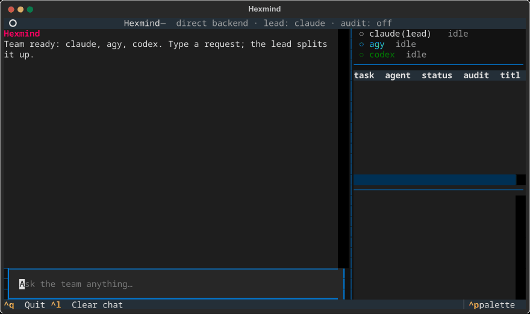
  <br><em>Captured from the real Textual room running a scripted harness — no API calls, no staging.</em>
</p>

<p align="center"></p>

## 🏗 Architecture

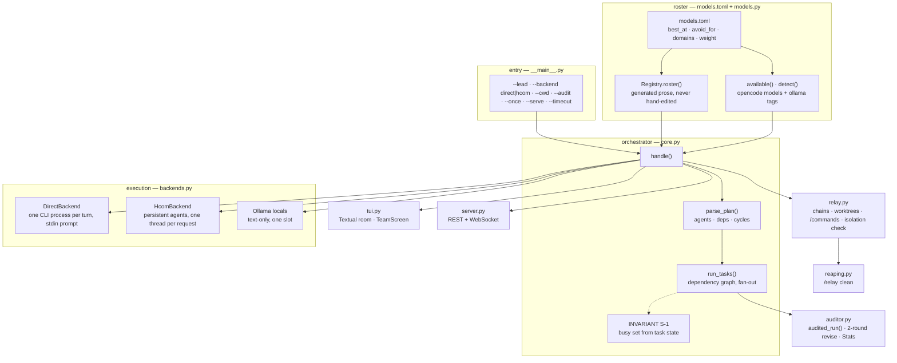

The registry is the only source of truth. Everything the lead reads, every argv the backends run, every colour the TUI shows and the hcom exclusion are all generated from `models.toml` — so a model cannot be described one way in the room and another way in the docs.

## 🔀 How a request flows

<p align="center"></p>

1. **Plan.** The lead gets the roster (strengths plus audit track record), your request and
   the last few exchanges. It answers with JSON: a reply to you plus tasks, each with an
   `agent`, `instructions`, `depends_on`, a `domain` and an optional `gate`.
2. **Validate.** Unknown agents fall back to the lead, unknown dependencies are dropped,
   duplicate ids and dependency cycles are rejected. If the lead answers in prose, that
   prose is the answer.
3. **Run as a graph.** Every task whose dependencies are done starts at once. Each task gets
   the outputs of the tasks it depends on. When a task fails, everything downstream is
   marked `skipped`, and one agent failing never takes down the room.
4. **Audit** (if on). See [Peer audit](#-peer-audit).
5. **Summarize.** The lead reads every result and writes you one answer covering what was
   done, what failed, and what needs your decision.

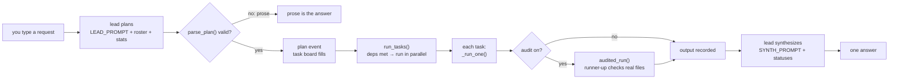

<p align="center"></p>

## 🔁 Relay chains

A **chain** is an ordered list of stages. Each stage is done by one model, which first
reads the full report of every earlier stage from a shared notes file. Run several chains
at once and Hexmind rotates the models through the stages.

<p align="center"></p>

### Example: three full repo audits by three models

The `rip-it-apart` chain — an [example chain](docs/examples/chains/README.md) you copy into
`~/.config/hexmind/chains/`, because it imports agent files that live on your machine rather
than in this package — runs six stages (recon → verify → bug-hunt → strengths → critic →
fix-plan), so any model can run any stage.

```sh
cp docs/examples/chains/rip-it-apart.toml ~/.config/hexmind/chains/
```

```
/relay rip-it-apart x3
```

With the default `--assign rotate`, each chain starts on a different model. This is the
real assignment grid:

| chain | recon | verify | bug-hunt | strengths | critic | fix-plan |
|---|---|---|---|---|---|---|
| A | claude | agy | codex | claude | agy | codex |
| B | agy | codex | claude | agy | codex | claude |
| C | codex | claude | agy | codex | claude | agy |

- **Every model runs every stage** somewhere across the three chains.
- **No model runs two stages in a row**, so the critic is never the model that just wrote
  the stage before it.
- **Chains don't collide.** With `-n > 1` inside a git repo, each chain gets its own git
  worktree and branch (`hexmind/<run>-A`, `-B`, …).
- **Results are merged.** The lead combines the three chains. Findings several chains agree
  on count as high confidence, and findings only one chain reported are flagged for a second look.

Rotation is round-robin, so with three models the critic of a chain is also the model that
ran its `verify` stage. If you want strict separation for a stage, pin it with `agent = "…"`
and `--assign pinned`.

### More ways to relay

```
/relay feature --goal "add CSV export" --assign pinned   # saved chain, pinned models
/relay feature --goal "add CSV export" --assign best     # lead picks a model per stage
/relay "migrate the config to TOML" -n 2 --end compare   # lead designs the stages itself
/relay opencode-team --assign pinned --goal "..."        # audit -> TDD build -> coverage -> critique
/relay fix-review --assign pinned --goal "..."           # fix it test-first, then attack the fix
/relay audit --assign pinned --goal "audit a..b"          # review for errors + coverage for omissions
/relay clean                                            # list reapable runs; --force removes them
```

> **Run the long chains with a raised timeout.** A TDD stage can legitimately take longer than the
> 30-minute default: `hexmind --audit --timeout 5400`.

**`opencode-team`, `fix-review` and `audit` are how this project builds itself** — see
[`docs/BUILD-PATH.md`](docs/BUILD-PATH.md). Every stage is pinned to a specific model, on purpose:
the builder is never the reviewer, and the two auditors fail in opposite directions — one hunts
what is *wrong*, one hunts what is *missing*.

If the name isn't a saved chain, the whole text becomes a goal and the lead designs a
3–7 stage chain for it.

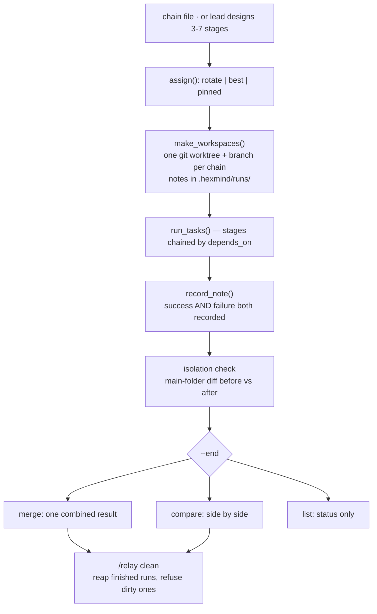

<details>
<summary><b>All <code>/relay</code> options</b></summary>

| option | values | default |
|---|---|---|
| `-n N` / `xN` | number of parallel chains | `1` |
| `--assign` | `rotate` · `best` (lead picks per stage) · `pinned` (stage's `agent =`) | `rotate` |
| `--workspace` | `shared` · `worktree` (own git worktree + branch per chain) | `worktree` if `-n > 1` in a git repo, else `shared` |
| `--end` | `merge` (one combined result) · `compare` (side by side) · `list` (status only) | `merge` |
| `--goal TEXT` | extra goal/context for a saved chain | chain description |

</details>

Stage reports are kept in `.hexmind/runs/<run>/chain-<X>.md` (Hexmind gitignores
`.hexmind/` automatically).

<p align="center"></p>

## 🔍 Peer audit

Turn it on with `--audit` or `/audit on`. **A model never reviews its own work** — every task
is checked by a model that did not write it:

1. **Primary** does the task.
2. **Runner-up audits.** Among the other members, the one with the best track record in the
   task's domain audits it. The auditor is told to check the actual files and state in the
   task's folder, not just trust the report, and to answer `VERDICT: PASS` or `VERDICT: FAIL`
   with specific issues.
3. **Bounded revise loop.** On `FAIL`, the primary gets the auditor's issues and its previous
   output and revises. Then the auditor checks again. The loop is capped at 2 audit rounds.
4. **Resolution:**
   - `pass`: approved first time. `fixed`: approved after revision.
   - `disputed`: still failing after the last round. For a normal task you get an
     **ESCALATION** message with both sides: the auditor's issues and the last output.
   - **Gated tasks** (`"gate": true`, which the lead sets for high-impact work such as core
     logic, migrations and security) fail instead, so the tasks that depend on them are
     skipped rather than built on disputed work.

<p align="center"></p>

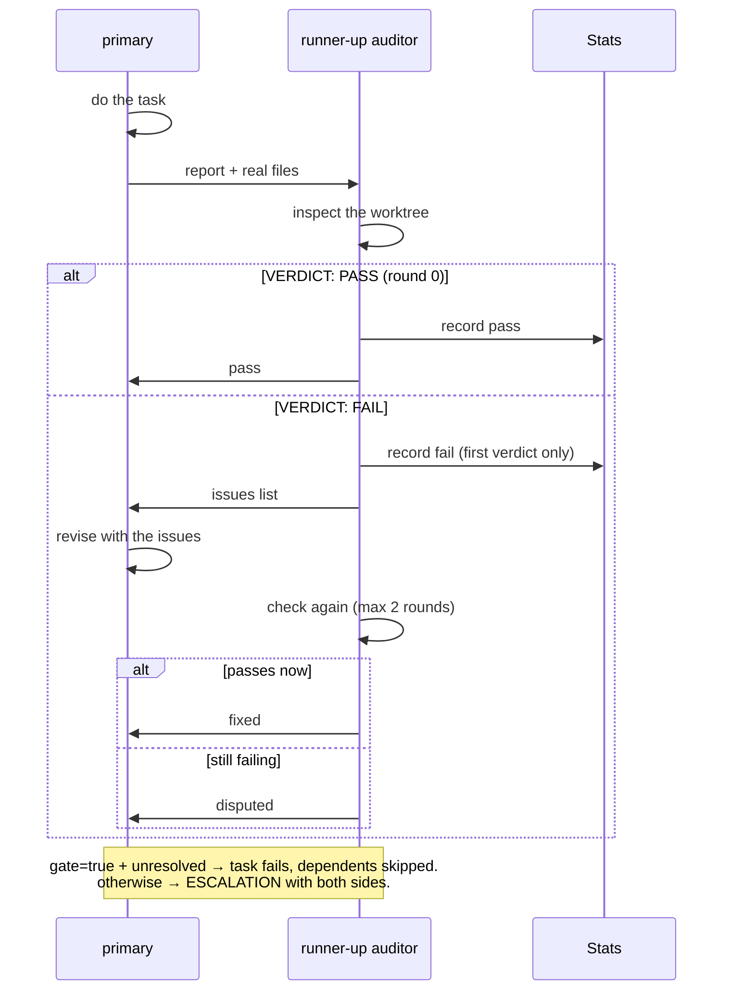

A reply with no verdict line counts as a `FAIL`. With a single member there's no one to
audit, so the task passes straight through.

<p align="center"></p>

## 📊 Rankings

Every audit's **first** verdict is recorded against the primary model in the task's domain.
Revisions do not count: the record measures first-attempt quality, not how hard someone had to be
argued into agreeing.

Domains: `architecture` `implementation` `refactor` `tests` `debugging` `research` `docs`
`review` `shell` `ui` `general`

```
/ranks
```

| Agent | implementation | tests | docs |
|---|---|---|---|
| claude | 7/8 | - | 3/3 |
| agy | 4/6 | 2/2 | - |
| codex | 5/5 | 6/9 | - |

*(Example of the format. Your numbers come from your own runs.)*

Cells are `passed / audited`. Rankings use a Laplace-smoothed score `(pass+1)/(pass+fail+2)`,
so one lucky result doesn't put a model at the top. The record:

- picks the **auditor**: the best-scored other member in the task's domain.
- is shown to the **lead** in the roster every time it plans, so assignments can follow the evidence.

Stats persist in `~/.local/share/hexmind/stats.json`.

<p align="center"></p>

## 🔖 Nicknames

Give your models names. Nicknames are display-only: the chat, team pane and task board show
them, but stats and config still use `claude`, `agy` and `codex`.

```
/nick claude Rex      # set
/nick claude          # clear
/nick                 # list
```

They are saved in `~/.config/hexmind/config.toml`:

```toml
[nicknames]
claude = "Rex"
```

The lead knows the nicknames, so you can just say *"have Rex review it"*.

<p align="center"></p>

## 🧰 Commands

### In the room

| command | what it does |
|---|---|
| *any text* | the lead plans it, the team runs it |
| `/team` | the roster: who is awake, who is asleep, who is working, and what each is for |
| `/models` | every known model, what it is best at, and whether it is installed |
| `/model NAME` | one model's card: **best at**, **not for**, domains, live audit record |
| `/sleep NAME` | put a model to sleep — refused while it is working ([Invariant S-1](#-the-team-and-who-is-awake)) |
| `/wake NAME` | bring it back, re-checking its CLI is actually installed |
| `/add NAME` | bring in a model this session never had (one added to `models.toml` after launch) |
| `/scan` | catalogue what is installed but is not a member — writes no registry entry |
| `/found [PROVIDER\|TEXT]` | browse that catalogue |
| `/profile NAME best_at="…"` | promote a find to a member; `best_at` is required |
| `/remove NAME` | take a model out of the session for good; its history stays on disk |
| `/recommend [REQUEST]` | ask the lead who it wants for this request — a proposal, not a decision |
| `/go` | hand the roster you settled on back for a plan; the lead is told what you dropped |
| `/cancel` | drop the proposal, keep the room |
| `/lead [NAME\|recommend]` | show the leader, change it, or **ask the team** who should lead |
| `/relay NAME\|GOAL [options]` | run a relay chain (see [options](#more-ways-to-relay)) |
| `/relay clean [--force] [--all]` | reap finished runs' worktrees and branches; refuses any with uncommitted work |
| `/chains` | list available chain files |
| `/audit on\|off` | toggle peer audit (no argument shows the current state) |
| `/ranks` | per-model, per-domain audit track record |
| `/drafts on\|off` | make the lead's plan wait for `/approve` or `/discard` before anything runs |
| `/nick [AGENT [NAME]]` | set, clear or list [nicknames](#-nicknames) |
| `/help` | command list |

Keys: `enter` send · `↑/↓` browse tasks · `ctrl+l` clear chat · `ctrl+q` quit.

<p align="center"></p>

## 🧠 The team, and who is awake

<p align="center"></p>

Sixteen models are registered. You will not run all of them — you **wake** the ones you want.

**Sleeping is a state, not a deletion.** A sleeping model keeps its registry entry, its `best_at`,
its audit record and its journal, so you can still ask what it did and why. Waking it resumes
that history rather than starting a stranger.

**`/model NAME` is the anti-misuse tool.** Every model states what it is *not* for, because the
costliest failure here is not an error — it is handing an architecture job to a model that will do
it competently and quietly badly. The lead reads the same fields, so the room and the docs cannot
disagree.

**`/lead recommend`** asks the room who should lead, briefed on every member's strengths and
their audit record. It deliberately never asks the outgoing lead: a model grading its own successor
is the one judgement its own track record cannot inform. **It advises. Nothing changes until you
run `/lead NAME`.**

> **Invariant S-1 — a working model cannot be put to sleep.** If a model holds a live task, the
> sleep request is refused and the blocking task is named. There is no override and no queue.
> A model mid-edit is writing real files in the room or in a relay worktree, and a half-written
> file is never worth the memory it would reclaim. The same rule governs reassignment: only
> `pending` tasks move between models.

<details>
<summary><b>CLI flags</b></summary>

| flag | default | |
|---|---|---|
| `--lead AGENT` | **none** | who plans and summarizes. Required for `--once` and `--serve`; change it later with `/lead` |
| `--backend direct\|hcom` | `direct` | how agents are run. `hcom` cannot reach the seven non-default opencode models and says so |
| `--without AGENT` | none | leave a member out (repeatable) |
| `--with AGENT` | none | add an opt-in member (repeatable) — `qwen`, `qwen-large`, `jules` |
| `--cwd DIR` | current dir | folder the team works in |
| `--audit` | off | start with peer audit on |
| `--approve-plans` | off | the lead's plan waits for `/approve` or `/discard` |
| `--timeout SECONDS` | `1800` | per-call agent timeout. A relay stage doing a full TDD cycle can exceed 30 min |
| `--once "REQUEST"` | none | run one request without the TUI and print the results |
| `--serve` | off | headless FastAPI + WebSocket server — needs the `server` extra |
| `--host HOST` | `0.0.0.0` | server bind address |
| `--port PORT` | `8765` | server port |

> [!NOTE]
> **`--lead` has no default, on purpose.** A hardcoded one crashed anyone without that
> model's CLI installed, and quietly picked the room's spokesperson for you. `--once` and
> `--serve` have nobody to ask, so they require it.

</details>

<p align="center"></p>

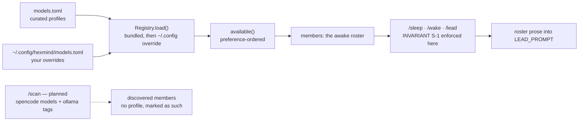

<p align="center">
  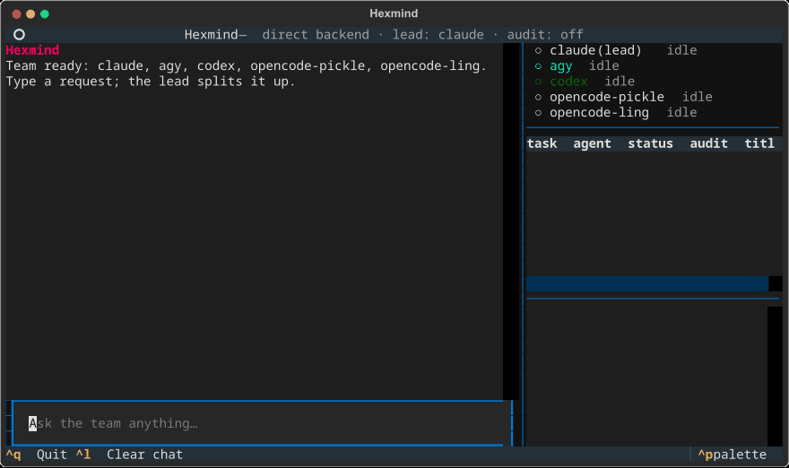
  <br><em>Same harness: every frame is the app itself, driven like a user would drive it.</em>
</p>

## 📡 Headless server

`hexmind --serve --lead claude` runs the same room with no TUI, for a phone or a web client. It needs
the `server` extra — `pip install -e ".[server]"` — and says so if it is missing rather than failing
with a `ModuleNotFoundError`.

| endpoint | what it does |
|---|---|
| `GET /api/status` | roster, lead, nicknames, active tasks, whether a plan awaits approval |
| `GET /api/history` | every message so far |
| `GET /api/chains` | available chain files, with an error per broken one |
| `GET /api/stats` | the audit table, raw data, and the domain list |
| `POST /api/prompt` | submit a request |
| `POST /api/approve` · `/api/discard` | accept or drop a draft plan |
| `POST /api/config/nicknames` | set nicknames |
| `WS /ws/room` | full-duplex event stream: `init`, `message`, `plan`, `task`, `status`, `busy_state` |

> [!WARNING]
> The server binds `0.0.0.0` with a permissive CORS policy and **no authentication**, and the
> agents behind it run with edits auto-accepted. Anyone who can reach the port can drive agents
> that write files. Keep it on a trusted network, or put it behind a proxy that authenticates.
> Closing this is tracked in [`docs/BUILD-PATH.md`](docs/BUILD-PATH.md).

<p align="center"></p>

## 🪟 Qt front-end

The same room as a widget, for embedding in any Qt app. PySide6 is opt-in (`pip install -e ".[qt]"`,
~240 MB) and nothing above changes without it.

```python
from hexmind.qt import HexmindWidget

room = HexmindWidget()                 # or HexmindWidget(parent) when embedding
room.openFileRequested.connect(editor.open)   # optional: a path double-clicked in a task title
stack.addWidget(room)
```

One brain, not a second implementation: a turn goes through the same orchestrator the TUI drives,
so sleep, lead, the busy set and the audit behave identically whichever front-end asked. A turn runs
on a worker thread with its own event loop — a model can think for thirty minutes, and the GUI must
not. The lead combo is the picker: with no lead chosen, sending says so and sends nothing.

It embeds into [Aether](docs/AETHER-INTERFACE.md) (one-way: Hexmind never imports Aether), and runs
standalone too.

<p align="center"></p>

## 📜 Chain files

Chains are TOML. Hexmind reads `~/.config/hexmind/chains/` first — yours win — then the bundled
`hexmind/chains/`: **`feature`**, **`opencode-team`**, **`fix-review`** and **`audit`**. Only
self-contained chains are bundled; a chain that imports your own agent files belongs in
[`docs/examples/chains/`](docs/examples/chains/README.md) to copy.

```toml
name = "feature"
description = "Spec, build, test, and review one feature"

[[stages]]
name = "spec"
instructions = "Read the code this touches. Write a short spec. Don't write code."
domain = "architecture"      # optional: ranking domain for this stage
agent = "claude"             # optional: used with --assign pinned
gate = true                  # optional: unresolved audit failure blocks later stages

[[stages]]
name = "review"
from = "code-reviewer.md"    # import an existing agent's instructions
```

**Bring your existing agents.** `from =` turns an agent you've already written into a stage
any model can run. Give a bare filename and Hexmind looks in `~/.claude/agents/`,
`~/.agents/agents/`, `./.claude/agents/` and `./.agents/agents/` — agents are per-user, so a
package can't know where yours are. Give a full path and it must exist as written; a missing
path is reported rather than silently resolved to some same-named file elsewhere.

- **Claude Code agents** (`.md`): the frontmatter is stripped and the body becomes the instructions.
- **Codex agents** (`.toml`): Hexmind reads `developer_instructions`, falling back to
  `instructions` or `description`.

<p align="center"></p>

## 🔌 Backends

Every backend has the same interface: `await backend.run(agent, prompt, cwd) -> str`.

| backend | status | how it works |
|---|---|---|
| **direct** | ✅ default | Hexmind launches each CLI in non-interactive mode itself and sends the prompt on stdin, so prompts of any size work (`claude -p`, `agy` stream-json, `codex exec -`) — except `kimi`, whose `-p` takes the prompt as an argv token instead. Nothing else to install; each call has a 30-minute timeout, and a timed-out process is killed and reaped. |
| **hcom** | ✅ live-tested with Claude | `--backend hcom`: each model is a persistent, headless [hcom](https://pypi.org/project/hcom/) agent, started the first time it gets work and reused after that (a warm request took under 4 s). Every request runs on its own thread, so replies never mix. Hexmind waits until an agent is ready, and never inherits the hcom identity of whatever launched it. Requires `hcom`. A folder a CLI has never opened stops at that CLI's trust prompt: Hexmind stops the agent and tells you to open the folder once (`cd <folder> && claude`) and accept. |

<p align="center"></p>

## 🧭 Roadmap

<p align="center"></p>

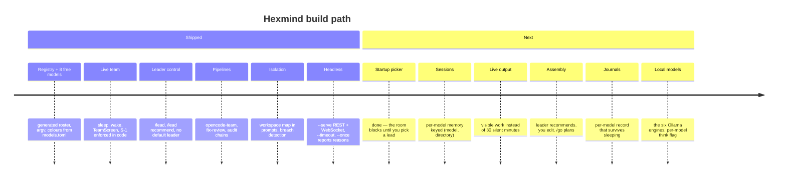

Shipped here is proven by the suite; next is ordered by dependency. The full map lives in
[`docs/BUILD-PATH.md`](docs/BUILD-PATH.md). What follows is the short version.

**Shipped**

- [x] **Core team:** lead planning, parallel task graph, direct backend, Textual TUI
- [x] **Relay chains:** saved, imported or lead-designed chains, N in parallel, rotating models, worktrees
- [x] **Peer audit:** runner-up auditor, bounded revise loop, gated tasks, escalation
- [x] **Evidence-based rankings:** per-domain track record that drives auditor choice and lead assignments
- [x] **Model registry:** `models.toml` as the single source of truth; roster prose, argv, colours and the hcom exclusion all generated from it
- [x] **All 8 free opencode models** as team members, plus Space Bunny and LongCat 2.5
- [x] **Live team:** `/sleep` `/wake` `/models` `/model` `/team` and the `TeamScreen` modal — INVARIANT S-1 enforced in the UI, not just the model
- [x] **Leader control:** `/lead`, `/lead recommend`, and **no default leader** — you pick
- [x] **Isolation:** a task is told which directory is its own, and a breach is *detected* and blamed on the stage that caused it
- [x] **Two self-auditing pipelines:** `opencode-team` (audit → TDD build → coverage → critique) and `fix-review` / `audit`
- [x] **`/relay clean`:** reaps finished worktrees, refuses any with uncommitted work
- [x] **hcom backend:** persistent headless agents, one thread per request
- [x] **Headless server:** `--serve` with REST + WebSocket for a phone or web client
- [x] **Jules**, **nicknames**, **mobile/touch layout**, **`--timeout`**
- [x] **Startup leader picker** — a session with no lead blocks until you pick one
- [x] **Roster changes at runtime:** `/add` and `/remove` alongside `/sleep` and `/wake`
- [x] **`/scan` → `/found` → `/profile`:** catalogue what is installed — 122 models here, 16 curated —
      then promote exactly one, deliberately, by writing down what it is for
- [x] **Qt front-end** — `from hexmind.qt import HexmindWidget`, the same room as a widget, behind
      the opt-in `qt` extra. Embeds in [Aether](docs/AETHER-INTERFACE.md)
- [x] **Team assembly:** `/recommend` → you edit the live room → `/go` makes the lead plan against what you chose ([design](docs/TEAM-ASSEMBLY.md))
- [x] **Chains and skills in a plan:** the lead can ask for a relay chain — run for real through
      `/relay`, with a provenance line in its notes — and for a skill to use. `create` and `edit`
      come back as proposals: **nothing is written to your skill directory without your say-so**

**Next** — [`docs/BUILD-PATH.md`](docs/BUILD-PATH.md) is the map, re-derived from the code;
[`docs/OPENCODE-TEAM-PLAN.md`](docs/OPENCODE-TEAM-PLAN.md) is why any of this exists

- [ ] **Per-model sessions.** Every model keeps its own conversation across turns, keyed
      `(model, directory)`. opencode sessions are directory-bound and *hang* rather than error,
      which is why the guard is day-one work and not a follow-up
- [ ] **Live output.** A model is currently silent for up to thirty minutes while it thinks.
      It should be visibly working
- [ ] **Per-model journals**, and the leader's over-provisioning advisor
- [ ] **The local Ollama models** from the model report, with a per-model `think` flag
- [ ] **Preference weighting** so the free opencode models are actually favoured
- [ ] **hcom split-terminal mode:** watch each model work in its own pane

<p align="center"></p>

## 🔧 Development

```bash
pip install -e . pytest
python3 -m pytest tests
```

364 tests, a fake backend, no model CLIs and no network. They cover plan
parsing and the task graph (`test_core.py`), relay loading, rotation and worktrees
(`test_relay.py`), the auditor and rankings (`test_auditor.py`,
`test_audit_integration.py`), both backends with mocked subprocesses (`test_backends.py`,
`test_hcom_backend.py`), nicknames (`test_nicknames.py`), and the TUI running headless (`test_tui.py`).

<details>
<summary><b>Project layout</b></summary>

```
hexmind/
├── __main__.py   CLI entry point
├── models.toml   THE ROSTER, as data: best_at, avoid_for, domains, weight, tier
├── models.py     the registry; generates the prose the lead reads, validates availability
├── core.py       Task, Orchestrator, plan parsing, the task graph, team state (sleep/wake/lead)
├── relay.py      relay chains, worktrees, /commands, the isolation check
├── reaping.py    /relay clean — removes finished worktrees without eating anyone's work
├── auditor.py    peer audit, verdicts, Stats rankings
├── backends.py   direct + hcom backends, Ollama local models
├── tui.py        Textual room, responsive layout, TeamScreen
├── server.py     headless FastAPI + WebSocket daemon (--serve)
├── jules.py      the Google Jules cloud member
├── notify.py     phone ping when the room needs you back
├── config.py     nicknames (~/.config/hexmind/config.toml)
└── chains/       bundled chain files
```

<p align="center"></p>

### Why the roster is a data file

`models.toml` is the single source of truth. The prose the lead reads is **generated** from
`best_at` and `avoid_for`, and `DIRECT_CMDS`, `LOCAL_MODELS`, `AGENT_COLOR` and the hcom
exclusion all derive from it.

That is not tidiness. The roster used to be a hand-written dict, and `opencode-muse` came to be
described with *another model's* specialty — repo-wide scanning, which is `opencode-longcat`'s
job — with nothing to catch it. A model that claims it is good at repo scans gets given repo
scans. **Now a description cannot drift from the data behind it**, and you can override any model
without touching Python:

```toml
# ~/.config/hexmind/models.toml
[models.opencode-mimo]
label = "My MiMo"
best_at = "only the narrow-mode layout work I care about"
avoid_for = "anything touching the chat log"
```

</details>
