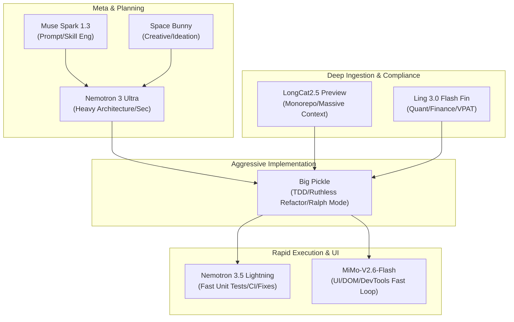

# Opencode-CLI Free Models Operational Blueprint & Skill Mapping

This document provides a comprehensive technical breakdown of the 8 free models available within `opencode-cli`. It maps each engine to its optimal operational role, technical strengths, anti-patterns, and the specific skills and agents installed in the local environment (`/home/daripper/.agents/skills`).

---

## 🏗️ Architecture & Model Orchestration Matrix

---

## 📊 Summary Comparison Matrix

| Model | Primary Specialty | Context / Speed Profile | Key Installed Agent Roles | Top Target Skills |
| :--- | :--- | :--- | :--- | :--- |
| **Ling 3.0 Flash Fin** | Quant, Finance, Legal Compliance & Auditing | Ultra-Fast / Low Latency | Financial Auditor, Compliance Lead | `compliance-mapping`, `financial-report-search`, `quantitative-analysis` |
| **MiMo-V2.6-Flash** | UI/UX, DOM parsing, DevTools, Fast Prototyping | High Throughput / Vision-DOM | Frontend Specialist, DevTools Observer | `frontend-design`, `chrome-devtools`, `screen-reader-lab`, `webapp-testing` |
| **Space Bunny** | Creative Ideation, Unconventional Spikes, Storytelling | High Divergence / Balanced Speed | Feature Ideator, Tech Storyteller | `brainstorming`, `feature-ideator`, `lateral-thinking`, `game-engine` |
| **LongCat2.5 Preview** | Monorepo ingestion, Massive Context, Cross-Doc Synthesis | Massive Context Window / Deep Read | Monorepo Historian, Synthesis Lead | `cross-document-analyzer`, `postmortem-aggregator`, `repomix-manager` |
| **Nemotron 3.5 Lightning** | Atomic Unit Tests, Fast CI triage, Lint/Format Fixes | Sub-Second Latency / High RPM | CI Triage Worker, Micro-Refactorer | `quick-fix`, `test-generation`, `pytest-coverage`, `actions-manager` |
| **Nemotron 3 Ultra** | Heavy Systems Architecture, Concurrency, Hardcore Security | Heavy Reasoning / Deep Chain-of-Thought | Lead Architect, Security Assessor | `plan-author`, `system-design`, `security`, `ruthless-refactorer`, `performance` |
| **Big Pickle** | God-Mode Execution, Stubborn TDD, Unforgiving Refactors | Autonomous Iterative Loop / Unrelenting | Code Implementer, Ralph-Mode Runner | `code-implementer`, `load-pickle-persona`, `ralph-mode`, `test-driven-development` |
| **Muse Spark 1.3** | Meta-Prompting, Agent Authoring, Rule Synthesis | Precision Syntax / Structured Schema | Skill Architect, Prompt Engineer | `skills-author`, `skill-creator`, `writing-rules`, `writing-hookify-rules` |

---

## 🔬 In-Depth Model Breakdowns

### 1. Ling 3.0 Flash Fin
* **Model Overview & Core Strengths:** Fine-tuned specifically for quantitative rigor, financial accounting, legal compliance standards, and structured tabular reasoning. It excels where arithmetic precision and strict adherence to regulatory matrices (such as Section 508, VPAT 2.5, and SEC filings) are non-negotiable.
* **Best Usages:**
  - Auditing VPAT tables and mapping accessibility criteria against Section 508 / EN 301 549.
  - Analyzing financial earnings transcripts, SEC 10-K filings, and balance sheets.
  - Generating structured SQL aggregation queries, database normalization audits, and indexing performance models.
* **Anti-Patterns & Limitations:** Do not use for free-flowing creative prose, game logic, or rapid multi-file refactors.
* **Recommended Installed Skills:**
  - [`compliance-mapping`](file:///home/daripper/.agents/skills/compliance-mapping/SKILL.md)
  - [`legal-compliance-mapping`](file:///home/daripper/.agents/skills/legal-compliance-mapping/SKILL.md)
  - [`financial-report-search`](file:///home/daripper/.agents/skills/financial-report-search/SKILL.md)
  - [`quantitative-analysis`](file:///home/daripper/.agents/skills/quantitative-analysis/SKILL.md)
  - [`database-analyst`](file:///home/daripper/.agents/skills/database-analyst/SKILL.md)
  - [`sql-optimization`](file:///home/daripper/.agents/skills/sql-optimization/SKILL.md)
  - [`data-visualization-accessibility`](file:///home/daripper/.agents/skills/data-visualization-accessibility/SKILL.md)
* **Agent / Subagent Pairing:** Pair with the `research` subagent to act as the quantitative and compliance verification node.
* **Operational Best Practices:**
  - Enforce explicit JSON or Markdown table schemas in output constraints.
  - Provide raw data chunks directly; avoid ambiguous open-ended phrasing.

---

### 2. MiMo-V2.6-Flash
* **Model Overview & Core Strengths:** High-throughput multi-modal / DOM-native Flash model designed for rapid structural parsing, live DevTools event triage, HTML/CSS layout reconciliation, and fast accessibility simulations.
* **Best Usages:**
  - Rapid UI component generation and interactive front-end auditing.
  - Ingesting raw Chrome DevTools performance traces, DOM node trees, and accessibility trees.
  - Driving fast browser automation scripts (Playwright) and step-by-step screen reader narration loops.
* **Anti-Patterns & Limitations:** Weak on heavy algorithmic design, complex concurrency locks, and deep multi-repository architecture.
* **Recommended Installed Skills:**
  - [`frontend-design`](file:///home/daripper/.agents/skills/frontend-design/SKILL.md)
  - [`chrome-devtools`](file:///home/daripper/.agents/skills/chrome-devtools/SKILL.md)
  - [`screen-reader-lab`](file:///home/daripper/.agents/skills/screen-reader-lab/SKILL.md)
  - [`webapp-testing`](file:///home/daripper/.agents/skills/webapp-testing/SKILL.md)
  - [`playwright-explore-website`](file:///home/daripper/.agents/skills/playwright-explore-website/SKILL.md)
  - [`web-component-specialist`](file:///home/daripper/.agents/skills/web-component-specialist/SKILL.md)
  - [`penpot-uiux-design`](file:///home/daripper/.agents/skills/penpot-uiux-design/SKILL.md)
* **Agent / Subagent Pairing:** Subagent worker for rapid parallel UI test runs (`dispatching-parallel-agents`).
* **Operational Best Practices:**
  - Keep conversational turns short and focused on atomic DOM or UI components.
  - Pipe raw DevTools / Playwright selector dumps directly into context for zero-friction debugging.

---

### 3. Space Bunny
* **Model Overview & Core Strengths:** High-entropy, lateral-thinking creative engine. Optimized for unblocking technical deadlocks, divergent feature ideation, playful yet rigorous gamification mechanics, and developer storytelling.
* **Best Usages:**
  - Brainstorming novel features and game engine physics/rendering mechanics.
  - Breaking through architectural roadblocks via cross-domain analogies and lateral thinking.
  - Generating engaging technical tutorials, narrative repository commit stories, and presentation slide decks.
* **Anti-Patterns & Limitations:** Prone to creative over-engineering if given strict deterministic tasks like unit test coverage or security patch verification.
* **Recommended Installed Skills:**
  - [`brainstorming`](file:///home/daripper/.agents/skills/brainstorming/SKILL.md)
  - [`feature-ideator`](file:///home/daripper/.agents/skills/feature-ideator/SKILL.md)
  - [`lateral-thinking`](file:///home/daripper/.agents/skills/lateral-thinking/SKILL.md)
  - [`game-engine`](file:///home/daripper/.agents/skills/game-engine/SKILL.md)
  - [`repo-story-time`](file:///home/daripper/.agents/skills/repo-story-time/SKILL.md)
  - [`comment-code-generate-a-tutorial`](file:///home/daripper/.agents/skills/comment-code-generate-a-tutorial/SKILL.md)
  - [`technical-blog`](file:///home/daripper/.agents/skills/technical-blog/SKILL.md)
  - [`eli5`](file:///home/daripper/.agents/skills/eli5/SKILL.md)
* **Agent / Subagent Pairing:** Exploratory research spike agent before formal architectural review.
* **Operational Best Practices:**
  - Use high temperature settings when unblocking creative stagnation.
  - Explicitly mandate the "first principles" constraint to ground its creative leaps in physical reality.

---

### 4. LongCat2.5 Preview
* **Model Overview & Core Strengths:** Ultra-large context window workhorse. Built to ingest and reason over massive single-pass payloads—entire monorepos, multi-year postmortem folders, concatenated documentation stacks, and comprehensive dependency graphs.
* **Best Usages:**
  - Analyzing entire Repomix / aggregated codebase bundles in one context.
  - Postmortem aggregation across multiple historical incident files (`POMO_AGGREGATED.md`).
  - Cross-referencing disparate documentation, academic literature, and multi-file dependency trees.
* **Anti-Patterns & Limitations:** Higher time-to-first-token on small single-line tasks; wasteful for simple micro-edits.
* **Recommended Installed Skills:**
  - [`cross-document-analyzer`](file:///home/daripper/.agents/skills/cross-document-analyzer/SKILL.md)
  - [`cross-page-analyzer`](file:///home/daripper/.agents/skills/cross-page-analyzer/SKILL.md)
  - [`postmortem-aggregator`](file:///home/daripper/.agents/skills/postmortem-aggregator/SKILL.md)
  - [`repomix-manager`](file:///home/daripper/.agents/skills/repomix-manager/SKILL.md)
  - [`literature-review`](file:///home/daripper/.agents/skills/literature-review/SKILL.md)
  - [`research-synthesis`](file:///home/daripper/.agents/skills/research-synthesis/SKILL.md)
  - [`multi-source-investigation`](file:///home/daripper/.agents/skills/multi-source-investigation/SKILL.md)
  - [`context-map`](file:///home/daripper/.agents/skills/context-map/SKILL.md)
* **Agent / Subagent Pairing:** Primary ingestion backend for the `research` subagent when performing repo-wide surveys.
* **Operational Best Practices:**
  - Combine multiple files into single structured blocks with explicit XML/Markdown headers.
  - Require citations and exact file line ranges (`file:///path#Lxx-Lyy`) for every synthesized claim.

---

### 5. Nemotron 3.5 Lightning
* **Model Overview & Core Strengths:** NVIDIA-optimized hyper-speed execution model. Features instant latency and razor-sharp adherence to single-turn instructions, making it the premier engine for automated CI fixes, linting, git commit generation, and fast unit test writing.
* **Best Usages:**
  - Rapidly generating pytest, Jest, and unittest suites for newly implemented modules.
  - Automated formatting, lint rule remediation, and micro-complexity reduction.
  - Generating Conventional Git commit messages and handling GitHub CLI triage (`gh-cli`, `actions-manager`).
  - Fast OS diagnostic scripts on Fedora ARM64/Asahi systems.
* **Anti-Patterns & Limitations:** Lacks deep strategic reasoning for multi-module architectural overhauls.
* **Recommended Installed Skills:**
  - [`quick-fix`](file:///home/daripper/.agents/skills/quick-fix/SKILL.md)
  - [`test-generation`](file:///home/daripper/.agents/skills/test-generation/SKILL.md)
  - [`pytest-coverage`](file:///home/daripper/.agents/skills/pytest-coverage/SKILL.md)
  - [`javascript-typescript-jest`](file:///home/daripper/.agents/skills/javascript-typescript-jest/SKILL.md)
  - [`git-commit`](file:///home/daripper/.agents/skills/git-commit/SKILL.md)
  - [`git-commit-generator`](file:///home/daripper/.agents/skills/gitcommit/SKILL.md)
  - [`code-formatter-converted`](file:///home/daripper/.agents/skills/code-formatter-converted/SKILL.md)
  - [`fedora-linux-triage`](file:///home/daripper/.agents/skills/fedora-linux-triage/SKILL.md)
  - [`actions-manager`](file:///home/daripper/.agents/skills/actions-manager/SKILL.md)
  - [`gh-cli`](file:///home/daripper/.agents/skills/gh-cli/SKILL.md)
* **Agent / Subagent Pairing:** Ideal lightweight worker pool for `dispatching-parallel-agents`.
* **Operational Best Practices:**
  - Keep prompts atomic: one function, one test file, or one failing CI log at a time.
  - Chain immediately into test runner commands (`pytest`, `npm test`) for instant validation.

---

### 6. Nemotron 3 Ultra
* **Model Overview & Core Strengths:** Heavyweight reasoning and enterprise systems architecture engine. Excels at deep algorithmic complexity, security threat modeling, database locking/concurrency strategies, and high-stakes code audits.
* **Best Usages:**
  - Formulating multi-phase architectural blueprints and formal ADRs (Architectural Decision Records).
  - Deep security vulnerability scanning (AST injection, auth bypass, secret leakage).
  - High-performance concurrency tuning (Rust async runtimes, Python asyncio/multiprocessing, ARM64 memory models).
  - Ruthless code reviews and dismantling architectural anti-patterns.
* **Anti-Patterns & Limitations:** Overkill for simple typos, one-liner patches, or basic markdown formatting.
* **Recommended Installed Skills:**
  - [`plan-author`](file:///home/daripper/.agents/skills/plan-author/SKILL.md)
  - [`plan-reviewer`](file:///home/daripper/.agents/skills/plan-reviewer/SKILL.md)
  - [`technical-planning`](file:///home/daripper/.agents/skills/technical-planning/SKILL.md)
  - [`system-design`](file:///home/daripper/.agents/skills/system-design/SKILL.md)
  - [`create-architectural-decision-record`](file:///home/daripper/.agents/skills/create-architectural-decision-record/SKILL.md)
  - [`ruthless-refactorer`](file:///home/daripper/.agents/skills/ruthless-refactorer/SKILL.md)
  - [`security`](file:///home/daripper/.agents/skills/security/SKILL.md)
  - [`performance`](file:///home/daripper/.agents/skills/performance/SKILL.md)
  - [`sql-code-review`](file:///home/daripper/.agents/skills/sql-code-review/SKILL.md)
  - [`python-specialist`](file:///home/daripper/.agents/skills/python-specialist/SKILL.md)
  - [`rust-mcp-server-generator`](file:///home/daripper/.agents/skills/rust-mcp-server-generator/SKILL.md)
* **Agent / Subagent Pairing:** Lead architect and validator agent (`plan-reviewer`, `plan-auditor`).
* **Operational Best Practices:**
  - Force chain-of-thought analysis on edge cases and failure modes before generating implementation code.
  - Require formal mathematical or algorithmic complexity bounds ($O(n)$, memory footprint).

---

### 7. Big Pickle
* **Model Overview & Core Strengths:** Unrelenting, zero-fluff autonomous implementation engine. Embodying the "Pickle Rick" / "Ralph Mode" philosophy, it operates without conversational hesitation, driving full-stack features from PRD to passing test suite while ruthlessly rejecting subpar solutions.
* **Best Usages:**
  - Full-throttle feature implementation following a validated technical plan.
  - Relentless bug hunting and regression fixing where other models give up ("Ralph mode").
  - Test-Driven Development (TDD) cycles: writing failing tests, writing code, verifying green tests.
  - Tearing down and replacing legacy codebases (`rip-it-apart`).
* **Anti-Patterns & Limitations:** Not designed for diplomatic feedback or speculative philosophical discussions.
* **Recommended Installed Skills:**
  - [`code-implementer`](file:///home/daripper/.agents/skills/code-implementer/SKILL.md)
  - [`load-pickle-persona`](file:///home/daripper/.agents/skills/load-pickle-persona/SKILL.md)
  - [`prd-drafter`](file:///home/daripper/.agents/skills/prd-drafter/SKILL.md)
  - [`ralph-mode`](file:///home/daripper/.agents/skills/ralph-mode/SKILL.md)
  - [`persistence`](file:///home/daripper/.agents/skills/persistence/SKILL.md)
  - [`rip-it-apart`](file:///home/daripper/.agents/skills/rip-it-apart/SKILL.md)
  - [`rip-it-apart-file`](file:///home/daripper/.agents/skills/rip-it-apart-file/SKILL.md)
  - [`test-driven-development`](file:///home/daripper/.agents/skills/test-driven-development/SKILL.md)
  - [`systematic-debugging`](file:///home/daripper/.agents/skills/systematic-debugging/SKILL.md)
  - [`verification-before-completion`](file:///home/daripper/.agents/skills/verification-before-completion/SKILL.md)
* **Agent / Subagent Pairing:** Primary autonomous implementation subagent (`self` with write + shell execution permissions).
* **Operational Best Practices:**
  - Provide clear pass/fail verification commands (e.g., `pytest tests/test_core.py`).
  - Instruct it to never mark tasks done until concrete CLI execution confirms clean status.

---

### 8. Muse Spark 1.3
* **Model Overview & Core Strengths:** Meta-programming and prompt engineering specialist. Built specifically to understand agent system prompts, tool schemas, MCP configurations, and Agent Skill specifications (`SKILL.md`, `RULE.md`, `AGENTS.md`).
* **Best Usages:**
  - Authoring and maintaining custom Agent Skills conforming to the open standard.
  - Designing and refining system instructions, hookify rules, and Cursor/Gemini rule sets.
  - Converting skills between platforms (Codex to Gemini CLI / opencode-cli extensions).
  - Optimizing prompts for cost, token efficiency, and deterministic tool usage.
* **Anti-Patterns & Limitations:** Suboptimal for direct application logic execution or low-level systems programming.
* **Recommended Installed Skills:**
  - [`skills-author`](file:///home/daripper/.agents/skills/skills-author/SKILL.md)
  - [`skill-creator`](file:///home/daripper/.agents/skills/skill-creator/SKILL.md)
  - [`skill-development`](file:///home/daripper/.agents/skills/skill-development/SKILL.md)
  - [`skill-porter`](file:///home/daripper/.agents/skills/skill-porter/SKILL.md)
  - [`writing-skills`](file:///home/daripper/.agents/skills/writing-skills/SKILL.md)
  - [`writing-rules`](file:///home/daripper/.agents/skills/writing-rules/SKILL.md)
  - [`writing-hookify-rules`](file:///home/daripper/.agents/skills/writing-rules/SKILL.md)
  - [`prompt_engineering`](file:///home/daripper/.agents/skills/prompt_engineering/SKILL.md)
  - [`prompt-builder`](file:///home/daripper/.agents/skills/prompt-builder/SKILL.md)
  - [`best-practices`](file:///home/daripper/.agents/skills/best-practices/SKILL.md)
  - [`create-rule`](file:///home/daripper/.agents/skills/create-rule/SKILL.md)
  - [`create-skill`](file:///home/daripper/.agents/skills/create-skill/SKILL.md)
  - [`create-agentsmd`](file:///home/daripper/.agents/skills/create-agentsmd/SKILL.md)
* **Agent / Subagent Pairing:** Meta-skill builder and agent evaluator subagent.
* **Operational Best Practices:**
  - Require strict adherence to YAML frontmatter and standard skill directory structures.
  - Validate prompt changes against explicit evaluation benchmarks.

---

## 🛠️ Recommended Multi-Model Pipeline Recipes

1. **Autonomous Feature Implementation Pipeline:**
   - **Step 1 (Ideation & PRD):** `Space Bunny` (`brainstorming`, `feature-ideator`) -> `Muse Spark 1.3` (`prd-drafter`).
   - **Step 2 (Architecture & Review):** `Nemotron 3 Ultra` (`plan-author`, `system-design`, `security`).
   - **Step 3 (Heavy Coding & TDD):** `Big Pickle` (`code-implementer`, `test-driven-development`).
   - **Step 4 (Micro-Fixes & Commits):** `Nemotron 3.5 Lightning` (`quick-fix`, `git-commit`).

2. **Full-Stack UI & Accessibility Audit Pipeline:**
   - **Step 1 (DOM & Live DevTools Scrape):** `MiMo-V2.6-Flash` (`chrome-devtools`, `screen-reader-lab`).
   - **Step 2 (VPAT & Legal Compliance Mapping):** `Ling 3.0 Flash Fin` (`compliance-mapping`, `legal-compliance-mapping`).
   - **Step 3 (Remediation & Fixes):** `Big Pickle` or `Nemotron 3.5 Lightning` (`web-issue-fixer`, `quick-fix`).

3. **Repository Forensic & Postmortem Pipeline:**
   - **Step 1 (Deep Repo Ingestion):** `LongCat2.5 Preview` (`repomix-manager`, `postmortem-aggregator`).
   - **Step 2 (Root Cause & Lock Analysis):** `Nemotron 3 Ultra` (`database-analyst`, `security`, `performance`).
   - **Step 3 (Meta Documentation & Skill Codification):** `Muse Spark 1.3` (`session-commit`, `create-agentsmd`).
